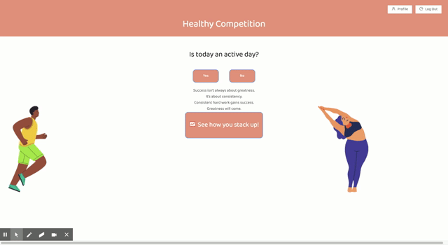

# HealthyCompetition App
[Deployed app](https://hidden-scrubland-71359.herokuapp.com/)

[GitHub Repo](https://github.com/DanielleByrne/gt-project-3)

## Description 
Are you having trouble sticking to your New Year’s Resolution to get in shape?  With HealthyCompetition, you are placed i a community of like-minded people and compete over time to see who is the fittest in your group.  

HealthyCompetition is an easy-to-navigate workout tracker that allows the user to simply mark whether or not a workout has been completed that day and compare the number of days they worked out to others on the application. We developed an application that builds a sense of community and accountability when it comes to working out. We cut the fuss out of other workout applications with our beautiful and  intuitive interface. 

User Story:
AS A competitive person trying to consistently workout
I WANT an app that easily tracks my workouts and group member’s workouts
SO THAT I can visualize my workout consistency over time while simultaneously competing against others. 

## Table of Contents 
* [Installation](#installation)
* [Usage](#usage)
* [Credits](#credits)
* [License](#license)

## Installation
Clone the repo, install all the npm packages, run in the browser.  

## Usage 
If you do not already have an account, register with your email and a password.  Once you either login or register, you will view your dashboard.  If today is an active day, click yes to create your workout.  If it is a rest day, click no.  You can also view your stats directly from this page.  Once your workout is complete, click "workout complete" and watch the clock transform into a flexed arm.  This will create your `Today's Workout` and `Streak`.  Your streak counts the consecutive number of workout days.  You can click `See How You Stack Up` or `Back to Team Page` from the Workout page to view your team's streaks and workout for the day.  This is where you can leave a message for a team member on the message board. You may logout if you wish, or stay logged in and close your browser or app. 
 

## Credits
Project for Georgia Tech Full-Stack Bootcamp

Group Members: Danielle Byrne, Jennifer Daeumler, Nicholas Mitchell, and Maya Stucky

ReactSpring Icons:

Icons made by <a href="https://www.flaticon.com/authors/darius-dan" title="Darius Dan">Darius Dan</a> from <a href="https://www.flaticon.com/" title="Flaticon">www.flaticon.com</a>

Icons made by <a href="https://www.flaticon.com/authors/freepik" title="Freepik">Freepik</a> from <a href="https://www.flaticon.com/" title="Flaticon">www.flaticon.com</a>

## License

Copyright (c) [2020]

Permission is hereby granted, free of charge, to any person obtaining a copy
of this software and associated documentation files (the "Software"), to deal
in the Software without restriction, including without limitation the rights
to use, copy, modify, merge, publish, distribute, sublicense, and/or sell
copies of the Software, and to permit persons to whom the Software is
furnished to do so, subject to the following conditions:

The above copyright notice and this permission notice shall be included in all
copies or substantial portions of the Software.

THE SOFTWARE IS PROVIDED "AS IS", WITHOUT WARRANTY OF ANY KIND, EXPRESS OR
IMPLIED, INCLUDING BUT NOT LIMITED TO THE WARRANTIES OF MERCHANTABILITY,
FITNESS FOR A PARTICULAR PURPOSE AND NONINFRINGEMENT. IN NO EVENT SHALL THE
AUTHORS OR COPYRIGHT HOLDERS BE LIABLE FOR ANY CLAIM, DAMAGES OR OTHER
LIABILITY, WHETHER IN AN ACTION OF CONTRACT, TORT OR OTHERWISE, ARISING FROM,
OUT OF OR IN CONNECTION WITH THE SOFTWARE OR THE USE OR OTHER DEALINGS IN THE
SOFTWARE.

## Contributing
Not accepting contributions at the time. 

